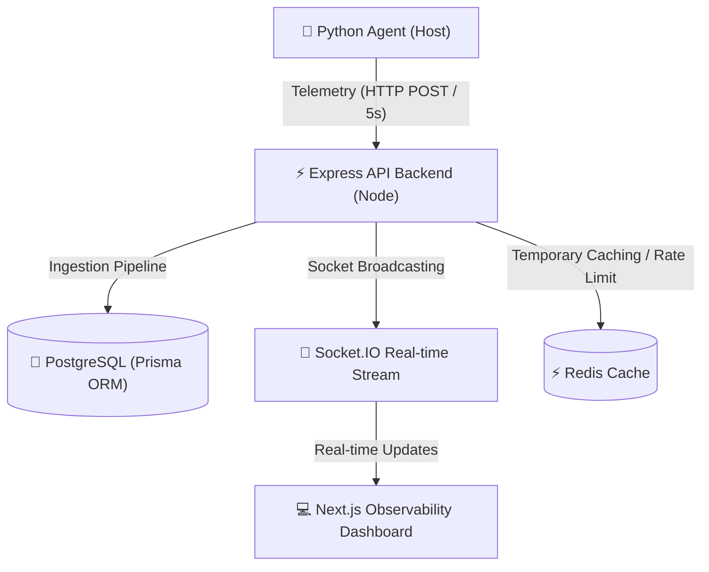

# 🚀 CLOUDPULSE — Real-Time Infrastructure Monitoring Platform

CloudPulse is a production-ready, modern, scalable host telemetry and infrastructure monitoring SaaS dashboard. Drawing inspiration from observability platforms like Datadog, Grafana and Vercel, it features real-time Socket.IO communication, Docker Orchestration, threshold alerting mechanisms and a lightweight Python monitoring agent.

---

## 📡 Architecture Diagram



---

## 🛠️ Technology Stack
- **Frontend**: Next.js (App Router), React, TypeScript, Tailwind CSS, Recharts, Lucide Icons, TanStack Query.
- **Backend**: Node.js, Express.js, TypeScript, Socket.IO, Prisma ORM, PostgreSQL, Redis.
- **Agent**: Python 3, `psutil`, `requests` telemetry loop.
- **DevOps**: Docker, Compose, GitHub Actions.

---

## 🏁 Quick Start: Running Simulated Sandbox Mode (Recommended)

To instantly explore the observability dashboard, the project includes an interactive **Demo Mode** bypass.
1. Install dependencies from root monorepo:
   ```bash
   npm install
   ```
2. Build workspace components:
   ```bash
   npm run build
   ```
3. Start the NextJS frontend server:
   ```bash
   npm run dev:web
   ```
4. Navigate to `http://localhost:3000` in browser. Click **View Sandbox Demo** or click **Sign In** and bypass credentials directly using the ADMIN/USER/VIEWER quick-bypass links.

---

## 🐳 Docker Deployment (Full Production Configuration)

Run the backend, caching layer, database, and client dashboards simultaneously:
1. Create a `.env` configuration file copying template variables:
   ```bash
   cp .env.example .env
   ```
2. Execute orchestration launch:
   ```bash
   docker-compose up --build
   ```
This initializes:
- PostgreSQL at `5432`
- Redis Cache at `6379`
- API Engine at `5001`
- Next.js Web Portal at `3000`

---

## 🐍 Telemetry Monitoring Agent Setup

Deploy the lightweight daemon on any host instance:
1. Navigate to the agent workspace:
   ```bash
   cd agent
   ```
2. Configure Python environment:
   ```bash
   python3 -m venv venv
   source venv/bin/activate
   pip install -r requirements.txt
   ```
3. Configure telemetry credentials:
   ```bash
   export API_URL="http://localhost:5001"
   export AGENT_TOKEN="YOUR_GENERATED_AGENT_TOKEN_FROM_DASHBOARD"
   ```
4. Run agent telemetry loop:
   ```bash
   python agent.py
   ```

---

## 🔒 Security Practices
- Centralized error sanitization mapping to API JSON responses.
- Secure bcrypt hash validation for passwords.
- JWT verification matching endpoint parameters.
- Role-based permissions matching ADMIN, USER, and VIEWER categories.
